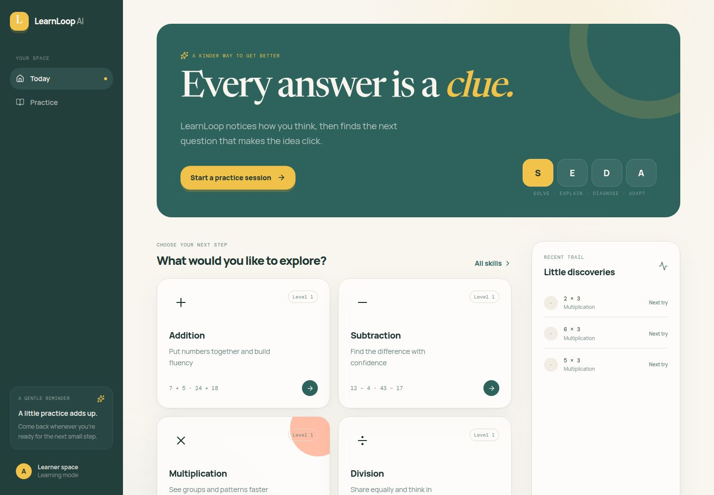
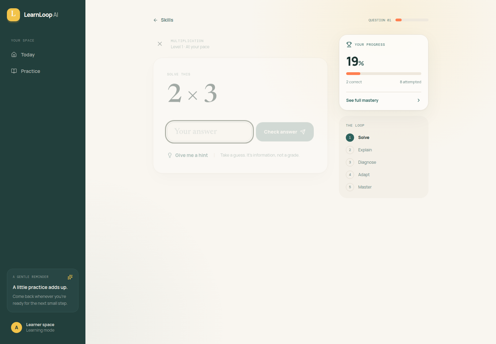
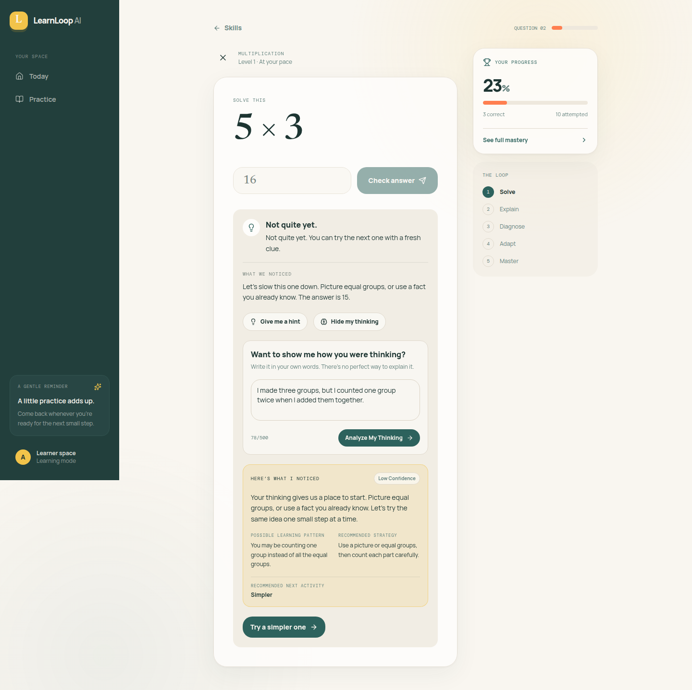
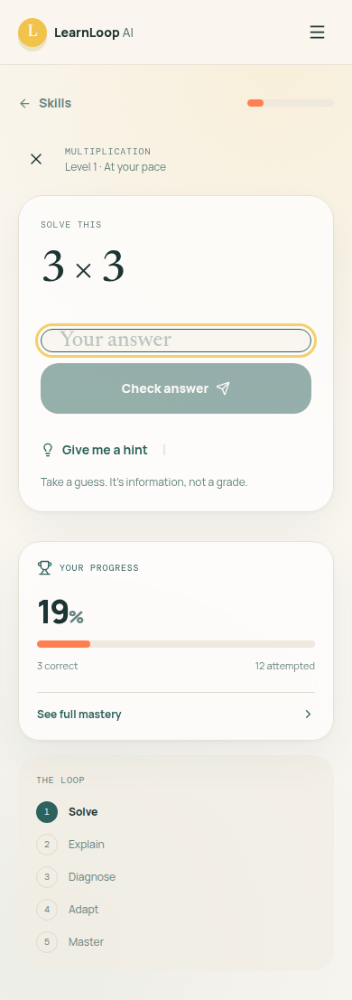

# LearnLoop AI

### Adaptive learning powered by deterministic progression and structured reasoning analysis.

LearnLoop AI is an adaptive elementary math learning application built around a simple loop: help a learner practice, understand their answer, identify a reasoning pattern, and choose a more useful next activity. The core learning behavior stays deterministic and testable, while a provider-based analysis layer turns learner thinking into structured feedback, strategy guidance, and a recommended next step.

> Current MVP scope: the analysis provider is a deterministic fallback. LearnLoop runs without a paid AI API or model credentials.

---

## 01 — What It Does

LearnLoop gives learners a focused practice experience across four arithmetic skills:

- Addition
- Subtraction
- Multiplication
- Division

Each session supports:

1. Choosing a skill from the skill shelf
2. Receiving a generated question at the current difficulty
3. Revealing a hint when needed
4. Submitting a numeric answer
5. Reviewing deterministic correctness feedback
6. Writing an optional explanation with **Explain My Thinking**
7. Requesting structured reasoning analysis after an incorrect answer
8. Following an adaptive recommendation such as retry, simpler, visual, or similar practice
9. Reviewing mastery, streak, accuracy, level, and recent activity

Visual activities render deterministic dot and group models for learners who benefit from a concrete representation of the arithmetic.

## The Core Product Loop

**Choose → Practice → Answer → Explain → Analyze → Adapt → Improve**

| Stage | Learner experience |
| --- | --- |
| **Choose** | Select an arithmetic skill from the skill shelf. |
| **Practice** | Work through a generated question at the current level. |
| **Answer** | Submit a numeric response and receive immediate feedback. |
| **Explain** | After an incorrect answer, describe the thinking behind it. |
| **Analyze** | Request a structured interpretation of the answer and explanation. |
| **Adapt** | Use the recommended retry, simpler, visual, or similar activity. |
| **Improve** | Build accuracy, streak, level, and mastery over time. |

---

## 02 — Architecture

### Deterministic Learning Engine

The learning engine is the source of truth for:

- Skill definitions and arithmetic question generation
- Reproducible question IDs based on skill, level, and seed
- Server-side answer reconstruction and validation
- Correctness scoring and feedback
- Difficulty changes from level 1 through level 5
- Streak updates
- Mastery calculation
- Recent activity tracking
- Selection of the next question or visual activity

Correct answers increase difficulty up to level 5. Incorrect answers reduce difficulty no lower than level 1. Mastery combines accuracy and level into a deterministic score.

The server reconstructs a submitted question from its question ID before scoring it. Client-provided expected answers do not determine correctness.

### Structured Reasoning Analysis

The analysis boundary is isolated behind a `LearningExplanationProvider` interface. It receives the question context, learner answer, optional explanation, difficulty, hint, and prior-attempt context. It returns a validated structure containing:

- Explanation
- Possible misconception
- Confidence
- Recommended strategy
- Recommended next activity

The current implementation registers only `fallback`. It uses deterministic rules to interpret answer distance, explanation keywords and length, difficulty, and repeated misses. Invalid provider output or provider errors are validated and safely resolved through the same fallback path.

This separation keeps answer validation, scoring, mastery, and progression independent from reasoning analysis. A future provider can implement the same interface without taking over the learning engine.

---

## 03 — Product Features

### Adaptive Practice

Question generation is deterministic and reproducible. Performance changes the next difficulty level, and the analysis result can guide the next activity type.

### Reasoning Analysis

**Explain My Thinking** gives an incorrect answer more context than a score alone. The analysis flow identifies possible reasoning patterns and recommends a concrete strategy for the next attempt.

### Feedback

Learners can reveal operation-specific hints and receive immediate explanations after submitting an answer. Feedback remains predictable because correctness is calculated by the server.

### Mastery

The mastery view surfaces accuracy, attempts, streak, current level, mastery percentage, and recent activity for each skill. Recent activity is intentionally limited to the eight most recent attempts in the MVP.

### Responsive UI

The React interface supports desktop and mobile layouts. Manual QA includes a mobile flow and verified the absence of horizontal overflow.

---

## 04 — Technology

### Frontend

- React
- TypeScript
- Vite
- Tailwind CSS
- TanStack React Query
- Framer Motion

### Backend

- Node.js
- Express
- TypeScript
- esbuild
- Pino logging

### API and Validation

- OpenAPI 3.1 contract
- Orval-generated React Query client
- Zod-generated request and response schemas
- Same-origin REST requests under `/api`

### Testing and Development

- pnpm workspaces
- TypeScript compiler
- Node.js built-in `node:test`
- Vite production builds

---

## 05 — System Design

```text
Learner
   ↓
React Frontend
   ↓
Generated React Query Client
   ↓
Express API (/api)
   ↓
Deterministic Learning Engine
   ├── Question generation
   ├── Answer validation
   ├── Scoring and mastery
   └── Progression state
   ↓
Structured Analysis Provider
   ↓
Zod-validated Result
   ↓
React Feedback and Next Activity
```

The current API surface includes:

| Endpoint | Purpose |
| --- | --- |
| `GET /api/healthz` | Service health check |
| `GET /api/skills` | List available math skills |
| `GET /api/skills/:skillId/question` | Generate a standard or visual practice question |
| `POST /api/attempts` | Score an answer and update learning state |
| `POST /api/analysis` | Analyze learner thinking and recommend a next activity |
| `GET /api/mastery/:skillId` | Read mastery data for a skill |
| `GET /api/activity` | Read recent activity |

The OpenAPI contract is the source for the generated frontend client and validation packages. The frontend calls the API through same-origin `/api` paths, so an integrated local browser session needs routing that serves the frontend at `/` and forwards `/api` to the API service.

---

## 06 — Engineering Decisions

### Keep learning correctness deterministic

Question generation, scoring, mastery, and difficulty are core product behavior. Keeping them server-controlled makes the learning loop reproducible and testable.

### Keep reasoning analysis separate

Reasoning analysis is requested explicitly through its own endpoint and provider interface. It can add contextual feedback without deciding whether an arithmetic answer is correct.

### Validate every structured result

Analysis output is checked against generated Zod schemas. Invalid output and provider exceptions fall back to a safe deterministic result instead of reaching the UI unchecked.

### Use typed API boundaries

OpenAPI, generated React Query hooks, and generated Zod schemas keep the frontend and API aligned around the same request and response shapes.

### Make visual support part of adaptation

Visual arithmetic is represented as a deterministic activity type, allowing the learning system to recommend a picture or equal-groups view without requiring a separate content pipeline.

### Keep MVP state explicit

Learning state is currently held in process memory. This keeps the MVP small and easy to reason about while making the persistence boundary clear for a later iteration.

---

## 07 — Testing & QA

Verified project evidence includes:

- **API learning-flow tests:** 4 passed, 0 failed
- **Workspace typecheck:** passed
- **Production build:** passed for the API and frontend packages
- **Browser QA:** eight requested learner flows passed
- **Mobile QA:** responsive flow passed with no horizontal overflow
- **Browser errors:** no page or console errors observed during QA
- **Smoke checks:** web response returned HTTP 200 and `/api/healthz` returned `{"status":"ok"}`

The automated learning-flow tests cover incorrect-answer analysis, visual multiplication activity, correct-answer mastery updates, and malformed analysis rejection.

---

## 08 — Product Preview

### Final product



### Practice session



### Reasoning analysis



### Mobile experience



---

## Repository Structure

```text
.
├── artifacts/
│   ├── api-server/
│   └── learnloop-ai/
├── lib/
│   ├── api-client-react/
│   ├── api-spec/
│   ├── api-zod/
│   └── db/
├── screenshots/
│   └── manual-qa/
├── scripts/
├── package.json
├── pnpm-lock.yaml
├── pnpm-workspace.yaml
└── README.md
```

- `artifacts/learnloop-ai/` — React learner experience and routes
- `artifacts/api-server/` — Express API and deterministic learning services
- `lib/api-spec/` — OpenAPI source contract and code generation configuration
- `lib/api-client-react/` — generated React Query client and fetch layer
- `lib/api-zod/` — generated request and response schemas
- `lib/db/` — database package boundary reserved for future persistence
- `screenshots/manual-qa/` — committed visual QA evidence
- `scripts/` — workspace scripts and post-merge setup

---

## 09 — Run Locally

### Install dependencies

```bash
pnpm install
```

### Run the API

In one terminal:

```bash
PORT=4321 AI_PROVIDER=fallback pnpm --filter @workspace/api-server run dev
```

The API requires a positive `PORT`. `AI_PROVIDER` defaults to `fallback`, and the current MVP has no external provider credential requirement.

### Run the frontend

In a second terminal:

```bash
PORT=18383 BASE_PATH=/ pnpm --filter @workspace/learnloop-ai run dev
```

The frontend requires both `PORT` and `BASE_PATH`. Because the generated client uses same-origin `/api` requests, route `/api` to the API process when running the two services behind a local reverse proxy.

### Verify the project

```bash
pnpm run typecheck
PORT=18383 BASE_PATH=/ pnpm -r --if-present run build
pnpm --filter @workspace/api-server test
```

### API contract generation

If the OpenAPI contract changes:

```bash
pnpm --filter @workspace/api-spec run codegen
```

---

## AI Configuration

The supported MVP configuration is:

```env
AI_PROVIDER=fallback
```

This selects the deterministic analysis provider. It is useful for predictable development and testing, while keeping the provider boundary ready for a future model-backed implementation. No OpenAI, Gemini, Anthropic, or other model integration is currently configured.

---

## 10 — Why This Project Matters

The interesting part is not simply adding an AI label to a learning application. LearnLoop separates deterministic learning progression from reasoning analysis, allowing the core behavior to remain predictable while the analysis layer adds context around how a learner approached a problem.

That boundary makes the system easier to test, easier to extend with new providers, and clearer to reason about as an AI product.

---

## Limitations and MVP Scope

The current implementation intentionally does not include:

- Authentication or learner accounts
- Persistent user profiles
- Database-backed learning history
- Payments
- Analytics
- A live external AI provider
- Production-scale deployment or multi-user isolation

Learning state is process-local and resets when the API process restarts. The current release focuses on demonstrating the adaptive learning loop, structured analysis boundary, and responsive learner experience.

---

**Built by Rachana Baddam**
